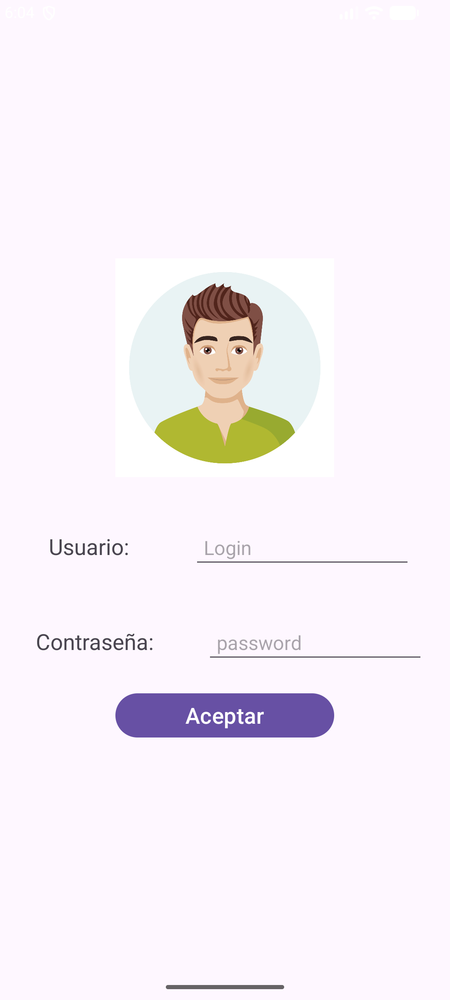
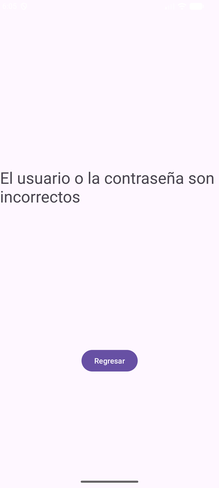

# Ejercicio 2.  Uso de Intents Implicitos y Explicitos

En el ejericio  realiza una aplicación sencilla donde se
diseñaron dos Activities, la primera se diseñó como si fuera un 
para que el usuario ingres el usuario y la contraseña, esa información
la encía a la segunta Activity mediante un Intent explicitos; en la segunda 
Activity recibe ala información del usuario y contraseña y 
los compara con valores guardados como constantes en on companion object.

El ejercicio se elaboró para mostrar el uso del diseño con LinearyLayout
y ConstraintLayout; también se mostró el uso de Intent Explicitos donde se 
abre la segunda Activity. En la segunda Activity, se programó 
notones para los siguientes acciones:
- Regresar a la Activity previa:  (temas: Task y la pila de activities)
- Enviar datos a otra Aplicación Agente de resolución de Intents: (temas tratados Intent Implicitos)
- Se enviaron datos para abrir el navegador y compartir en WhatsApp Web 
- Se enviaron datos para compartirlo WhatsApp
- Se emplea el Agente de Resolución de Intent 
- Se emplea Android Sharesheet

La aplicación utiliza los controles: **LinearLayout**, **TextView**, **EditText**, **Button**, **Toast**.
Se utilizaron los objetos **Intent** Implicitos y Explicitos

[//]: 

    

[//]: 

    

    

